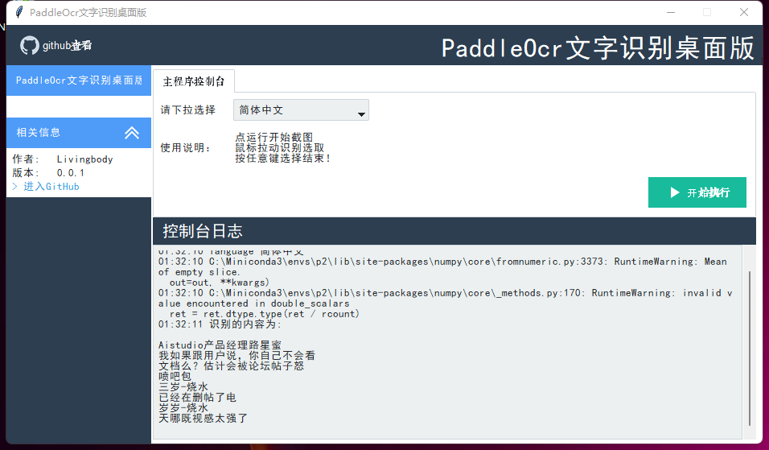

## AgentOCR桌面版

### 项目依赖
依赖AgentOCR、qgui

### 效果图
程序界面




### 代码
```
#!/usr/bin/python
# -*- coding: UTF-8 -*-
"""
@author:livingbody
@file:getimge.py
@time:2021/12/12
"""

import time
from PIL import ImageGrab
import sys
import os
import json

from qgui import CreateQGUI
from qgui.banner_tools import GitHub
from qgui.notebook_tools import Combobox, Label, RunButton
# 导入 OCRSystem 模块
from agentocr import OCRSystem
import cv2


# 截图
def cut():
    global img
    scrren_cut()
    img = cv2.imread('screen.jpg')
    cv2.namedWindow('image')
    cv2.setMouseCallback('image', on_mouse)
    cv2.imshow('image', img)

    cv2.waitKey(0)
    cv2.destroyAllWindows()
    os.remove('screen.jpg')


def scrren_cut():
    beg = time.time()
    debug = False
    image = ImageGrab.grab()
    image.save("screen.jpg")


def on_mouse(event, x, y, flags, param):
    global img, point1, point2
    img2 = img.copy()
    if event == cv2.EVENT_LBUTTONDOWN:  # 左键点击
        point1 = (x, y)
        cv2.circle(img2, point1, 10, (0, 255, 0), 5)
        cv2.imshow('image', img2)
    elif event == cv2.EVENT_MOUSEMOVE and (flags & cv2.EVENT_FLAG_LBUTTON):  # 按住左键拖曳
        cv2.rectangle(img2, point1, (x, y), (255, 0, 0), 5)
        cv2.imshow('image', img2)
    elif event == cv2.EVENT_LBUTTONUP:  # 左键释放
        point2 = (x, y)
        cv2.rectangle(img2, point1, point2, (0, 0, 255), 5)
        cv2.imshow('image', img2)
        min_x = min(point1[0], point2[0])
        min_y = min(point1[1], point2[1])
        width = abs(point1[0] - point2[0])
        height = abs(point1[1] - point2[1])
        cut_img = img[min_y:min_y + height, min_x:min_x + width]
        cv2.imwrite('cut.jpg', cut_img)


def print_image(image):
    from PIL import Image, ImageTk
    if isinstance(image, str):
        image = Image.open(image)
        print(image)
        image.show()


# 预测主程序
def infer(args):
    cut()
    language = args["语言选择"].get()
    print('language', language)
    # 初始化 OCR 模型
    if language == "繁体中文":
        config = 'cht'
    elif language == "英文":
        config = 'en'
    else:
        config = 'ch'

    ocr = OCRSystem(config=config)

    # 使用模型对图像进行 OCR 识别
    results = ocr.ocr('cut.jpg')
    text = ''
    for item in results:
        text = text + '\n' + item[-1][0]
    print('识别的内容为:\n' + text)
    return 1


def get_themes():
    p = r'ttkbootstrap_themes.json'
    if os.path.exists(p):
        f = open(p, 'r', encoding='utf-8')
        dict_data = json.load(f)
        print(dict_data)
        return dict_data


if __name__ == '__main__':
    # 创建主界面
    main_gui = CreateQGUI(title="PaddleOcr文字识别桌面版")

    # 在界面最上方添加一个按钮，链接到GitHub主页
    main_gui.add_banner_tool(GitHub(name='github查看', url="https://github.com/QPT-Family/QGUI"))
    # Combobox
    language = ['简体中文', '繁体中文', '英文']
    combox = Combobox(name="语言选择", options=language)
    main_gui.add_notebook_tool(combox)
    # 再加个文件夹选择工具
    main_gui.add_notebook_tool(Label(title="使用说明：", text='点运行开始截图\n鼠标拉动识别选取\n按任意键选择结束！'))
    # 添加一个运行按钮
    main_gui.add_notebook_tool(RunButton(infer))
    main_gui.set_navigation_info(title="PaddleOcr文字识别桌面版",
                                 info="")
    # 简单加个简介
    main_gui.set_navigation_about(author="Livingbody",
                                  version="0.0.1",
                                  github_url="https://github.com/QPT-Family/QGUI")
    # 跑起来~
    main_gui.run()


```